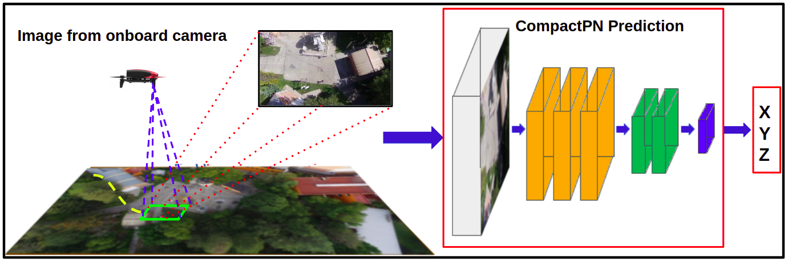
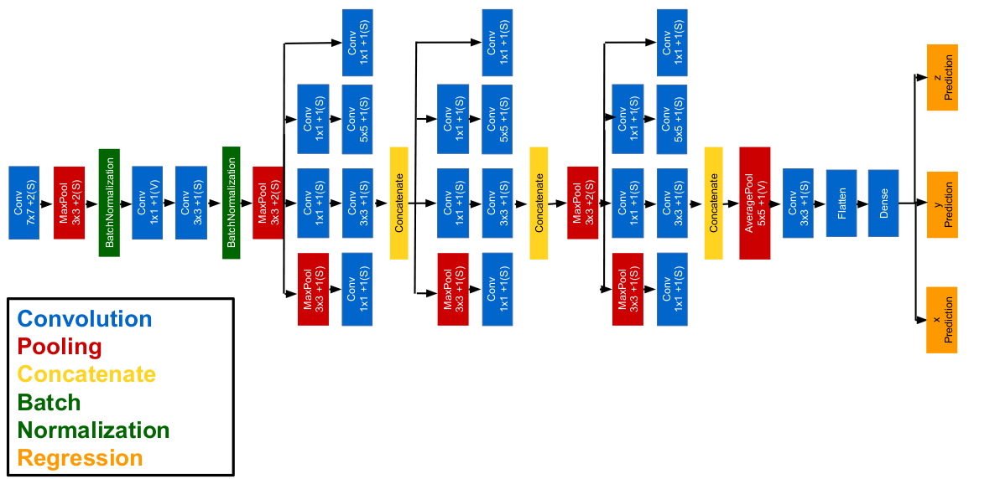

# Convolutional Neural Networks for Geo-Localisation with a Single Aerial Image

Nowadays, Unmanned Aerial Vehicles (UAVs) navigating outdoors rely heavily on GPS for localisation and autonomous flight or  applications for aerial photography recording with a GPS coordinate. However, GPS may fail or become unreliable, thus compromising the flight mission. Motivated by this scenario, in this work, we present a study on the use of popular Convolutional Neural Networks (CNN) to address the problem of geo-localisation from a single aerial image. We compare CNN-based architectures from the state of the art, and introduce a compact architecture to speed up the inference process without affecting the estimation error. For our experiments, aerial images were recorded with a monocular camera on board a UAV, flying outdoors with a height between 20 to 25 metres. On average, our compact network achieves a minimum estimation error of 2.8 metres and a maximum of 6.1 metres, which is comparable to the performance of other networks in the state of the art. However, our network achieves on average an operation frequency of 103 fps versus 69 fps achieved by the fastest network in the comparison analysis. These results are promising since such speed would enable fast geo-localisation with cameras capturing images at those frame rates, which are useful for obtaining neater images than with conventional cameras working at 30 fps.

## Overview of our approach



It consists of 2 steps: 1) Real-time image acquisition using the drone’s onboard camera. 2) GPS coordinates estimation using a compact convolutional neural network (CNN) based on PoseNet called \textbf{CompactPN} (Compact PoseNet).

## CompactPN Architecture
The architecture consists of 4 convolutional layers, 3 Inception modules, 1 fully-connected layers with the output layer separated
into three neurons, one for each coordinate after the pooling layer.



## Video
A video of this approach can be watched at [Youtube](https://youtu.be/xfsU_cCLpFw)

## Recommended system
- Ubuntu 16.04
- ROS kinetic Kame
- Python 2.7.15
- PyTorch 1.1.0
- Cuda 9.0
- Cudnn 7.3.0

### Additional Resources
- [Pretrained Model and Dataset](https://mnemosyne.inaoep.mx/index.php/s/Km4QGSR0hu7XiID)

## Reference
If you use any of data or code, please cite the following reference:

Cabrera-Ponce, A.A., & Martinez-Carranza, J. (2022). Convolutional Neural Networks for Geo-Localisation with a Single Aerial Image. Sensors, 19, 565–575 (2022). https://doi.org/10.1007/s11554-022-01207-1

```
@article{cabrera2022convolutional,
  title={Convolutional Neural Networks for Geo-Localisation with a Single Aerial Image},
  author={Cabrera-Ponce, Aldrich A and Martinez-Carranza, Jose},
  journal={Journal of Real-Time Image Processing},
  volume={19},
  number={3},
  pages={565--575},
  year={2022},
  publisher={Springer}
}
```
## Related References

- A. A. Cabrera-Ponce and J. Martinez-Carranza, "erial geo-localisation for MAVs using PoseNet," 2019 Workshop on Research, Education and Development of Unmanned Aerial Systems (RED UAS), Cranfield, United Kingdom, 2019, pp. 192-198, doi: 10.1109/REDUAS47371.2019.8999713

```
@inproceedings{cabrera2019aerial,
  title={Aerial geo-localisation for MAVs using PoseNet},
  author={Cabrera-Ponce, Aldrich A and Martinez-Carranza, J},
  booktitle={2019 Workshop on Research, Education and Development of Unmanned Aerial Systems (RED UAS)},
  pages={192--198},
  year={2019},
  organization={IEEE}
}
```

 ## Acknowledgements
We are thankful for the processing time granted by the National Laboratory of Supercomputing (LNS) under the project 201902063C. The first author is thankful to Consejo Nacional de Ciencia y Tecnología (CONACYT) for the scholarship No. 727018.
